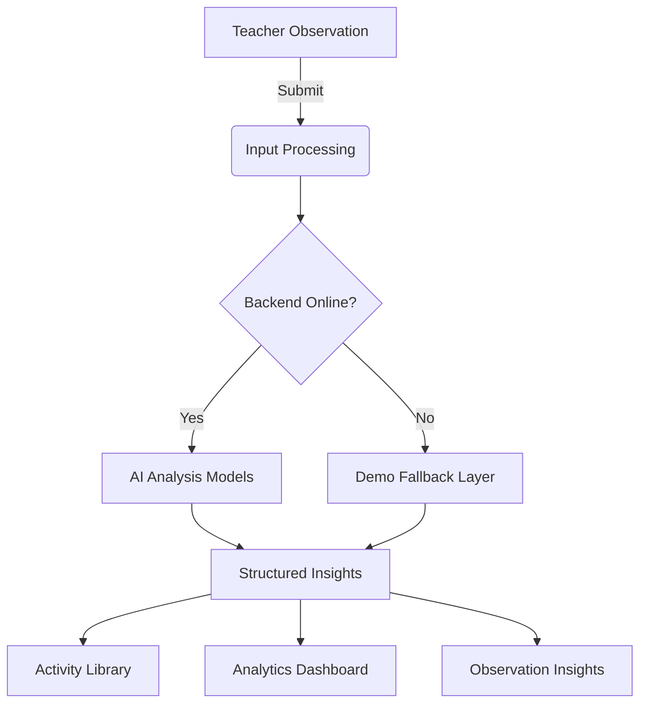

# 🌟 EduSpark AI — Smart Classroom Assistant

[](https://vitejs.dev/)
[](https://reactjs.org/)
[](https://www.typescriptlang.org/)
[](https://tailwindcss.com/)
[](https://opensource.org/licenses/MIT)

**EduSpark AI** is an advanced, AI-powered platform designed for early-childhood educators. It streamlines classroom observations, identifies learning difficulties in real-time, and generates tailored classroom activities—empowering teachers to provide personalized support to every student.

---

## 🚀 Key Features

| Feature | 📝 Description |
| :--- | :--- |
| **Observation Intelligence** | Submit text, audio, images, or PDFs for instant AI analysis. |
| **Multilingual Support** | Analyze observations in English, Arabic, French, and Spanish. |
| **Curriculum Mapping** | Insights are automatically mapped to early childhood curriculum topics. |
| **Activity Generator** | Specific, age-appropriate activities generated based on observed needs. |
| **Live Analytics** | Visualize trends in student progress and curriculum coverage. |
| **Model Monitoring** | Real-time health tracking of LLM, STT, and OCR models. |
| **Responsive Design** | Seamless experience across mobile, tablet, and desktop devices. |
| **Demo Continuity** | Intelligent fallback to demo data if the AI backend is unreachable. |

---

## 🛠️ Tech Stack

### Frontend & UI
- **Framework:** React 18 with TypeScript
- **State Management:** TanStack Query (v5)
- **Styling:** Tailwind CSS & shadcn/ui
- **Animations:** Framer Motion (v12)
- **Charts:** Recharts
- **Forms:** React Hook Form + Zod Validation

### Intelligence Layer (Local Backend)
- **LLM:** Ollama (Context-aware insights)
- **STT:** Whisper (Audio transcription)
- **OCR:** Tesseract (Handwritten/Printed text extraction)
- **Translation:** NLLB (Multi-language processing)

---

## 📁 Project Structure

```bash
eduspark-ai/
├── src/
│   ├── components/       # Reusable UI primitives and layout components
│   ├── hooks/            # Custom React hooks (mobile detection, notifications)
│   ├── pages/            # Main application views (Dashboard, Submit, Analytics)
│   ├── services/         # API client and backend interaction logic
│   ├── lib/              # Utility functions and shared helpers
│   └── test/             # Unit and integration test suites
├── public/               # Static assets
└── types/                # TypeScript type definitions
```

---

## 🔄 Application Workflow



### Pages & Navigation
- **Dashboard (`/`)**: High-level overview of classroom performance.
- **Submit (`/submit`)**: The heart of the app—where data becomes insights.
- **Insights (`/insights`)**: Historical view of all AI-generated findings.
- **Activities (`/activities`)**: Browse and filter curated educational tasks.
- **Analytics (`/analytics`)**: Deep-dive into classroom data and trends.
- **Status (`/status`)**: Live heartbeat monitor for the AI infrastructure.
- **Settings (`/settings`)**: Customize API endpoints and teacher preferences.

---

## ⚡ Getting Started

### Prerequisites
- [Node.js](https://nodejs.org/) (v20 or higher)
- [Bun](https://bun.sh/) or [NPM](https://www.npmjs.com/) (Standard package manager)

### Installation

1. **Clone the repository**
   ```bash
   git clone <repository-url>
   cd eduspark-ai
   ```

2. **Install dependencies**
   ```bash
   npm install
   ```

3. **Launch the development server**
   ```bash
   npm run dev
   ```

Access the application at `http://localhost:8080`.

---

## 💻 Available Scripts

| Command | Action |
| :--- | :--- |
| `npm run dev` | Starts the Vite development server with Hot Module Replacement. |
| `npm run build` | Compiles the application for production deployment. |
| `npm run preview` | Previews the production build locally. |
| `npm run test` | Executes the Vitest test suite. |
| `npm run lint` | Performs code quality checks via ESLint. |

---

## ⚙️ Configuration & API

The application connects to a local Python AI backend.
- **Default Endpoint:** `http://192.168.1.15:8000`
- **Dynamic Configuration:** You can update the API URL directly in the **Settings** page. This value is persisted in `localStorage` (`eduai_api_url`).

### API Endpoints
- `GET /health`: System and model status checks.
- `POST /teacher/analyze`: Textual observation processing.
- `POST /teacher/upload`: File-based analysis (Audio, Image, PDF).

---

## 🧪 Testing

### Unit & Integration
Powered by **Vitest** and **React Testing Library**.
```bash
npm run test          # Run once
npm run test:watch    # Development watch mode
```

### End-to-End
Powered by **Playwright**.
```bash
npx playwright test
```

---

## ❗ Troubleshooting

- **Blank Page?** Ensure all dependencies are installed with `npm install`.
- **Backend Connection Issues?** Verify the API URL in **Settings**. The app will show a "Demo Mode" banner if it can't reach the server.
- **OCR Failures?** Ensure the backend has Tesseract OCR installed and configured in the system PATH.

---

## 🤝 Contributing

We welcome contributions! Please feel free to submit a Pull Request or open an Issue for any bugs or feature requests.

1. Fork the Project
2. Create your Feature Branch (`git checkout -b feature/AmazingFeature`)
3. Commit your Changes (`git commit -m 'Add some AmazingFeature'`)
4. Push to the Branch (`git push origin feature/AmazingFeature`)
5. Open a Pull Request

---

Built with ❤️ for Educators by [Mathiyazhagan](https://github.com/MathiyazhaganNTL)
